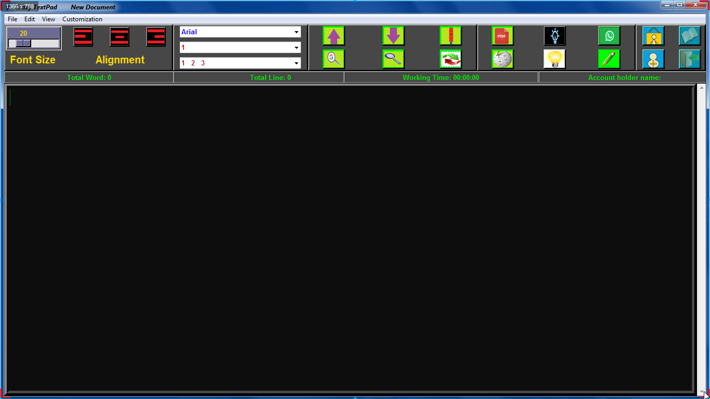

# <p align="center"> Presenting My New Project Crazy Textpad </p>



---
### <p align="left">💡 _Awesome Features of this Project are:_</p>
- ***_Dark Mode_***
- ***_Font Change_***
- ***_Alignment_***
- ***_Line Spacing_***
- ***_Bulleting_***
- ***_Text to PDF_***
- ***_PDF to Text_***
- ***_Search Something in Web_***
- ***_Send Message to Whatsapp via this Application_***
- ***_Get Details About Some Topics from Wikipedia_***
- ***_Working History Store_***


### <p align="left">➡️  _Some Important Functionality Used Here:_</p>
- ***_Undo_***
- ***_Redo_***
- ***_Cut_***
- ***_Copy_***
- ***_Paste_***
- ***_Find_***
- ***_Replace_***
- ***_Text Color Change_***
- ***_Automatically Total Word and Line Counter_***
- ***_Working Time_***


### <p align="left">⚒️ _Important Module Used Here:_</p>
- [x] ***_Tkinter_***
- [ ] ***_Pillow_***
- [x] ***_Time_***
- [x] ***_win32api_***
- [ ] ***_pyttsx3_***
- [x] ***_threading_***
- [x] ***_webbrowser_***
- [ ] ***_PyPDF2_***
- [x] ***_datetime_***
- [ ] ***_Pywhatkit_***
- [ ] ***_FPDF_***
- [ ] ***_mysql_***

- ### ***_Please have a look here:-_***

- [x] ===> ***_This Modules Comes With Python. You don't have to install it manually._***
- [ ] ===> ***_You have to install it manually. Details about that modules given below._***


### <p align="left">💻 _Module that You have to Install:_</p>
### 1. ***_Pillow_***
```<p align="center>
Pillow is a Python Imaging Library (PIL), which adds support for opening, manipulating, and saving images. The current version identifies and reads a large number of formats. Write support is intentionally restricted to the most commonly used interchange and presentation formats.
```
#### 🎯 Install Pillow by writing `pip install pillow` in your ***cmd or Terminal***
🎯
[To see Pillow Documentation Click Here](https://pypi.org/project/Pillow/)


### 2. ***_Pyttsx3_***
```<p align="center>
pyttsx3 is a text-to-speech conversion library in Python. Unlike alternative libraries, it works offline, and is compatible with both Python 2 and 3.
```
#### 🎯 Install Pyttsx3 by writing `pip install pyttsx3` in your ***cmd or Terminal***
🎯
[To see Pyttsx3 Documentation Click Here](https://pypi.org/project/pyttsx3/2.7/)


### 3. ***_Pywhatkit_***
```<p align="center>
Pywhatkit is used for send message to whatsapp
```
#### 🎯 Install Pywhatkit by writing `pip install pywhatkit` in your ***cmd or Terminal***
🎯
[To see Pywhatkit Documentation Click Here](https://pypi.org/project/pywhatkit/)


### 4. ***_PyPDF2_***
```<p align="center>
PyPDF2 is a python library built as a PDF toolkit. It is capable of: Extracting document information (title, author, …) Splitting documents page by page. ... Encrypting and decrypting PDF files.
```
#### 🎯 Install PyPDF2 by writing `pip install PypDF2` in your ***cmd or Terminal***
🎯
[To see PyPDF2 Documentation Click Here](https://pypi.org/project/PyPDF2/)

### 5. ***_MySQL_***
```<p align="center>
MySQL is a database to store information. Here I used it to store account details and other details properly.
```

```
Here I use a special submodule of mysql: mysql.connector
```
🎯 [Install MySQL from here for windows](https://mysql-com.en.softonic.com/)

#### 🎯 Install mysql.connector by writing `pip install mysql-connector` in your ***cmd or Terminal***
🎯
[To see mysql-connector Documentation Click Here](https://pypi.org/project/mysql-connector/)

### 6. ***_FPDF_***
```<p align="center>
Project description. FPDF is a library for PDF document generation under Python.
```
#### 🎯 Install FPDF by writing `pip install fpdf` in your ***cmd or Terminal***
🎯
[To see FPDF Documentation Click Here](https://pypi.org/project/fpdf/)

***
### !! Alert:-
- ### Storage Password for Log-in or Sign-up is the ***_MySQL Database Password_***


- ### _Account Password_ Can be Anything that You Want. 
- ### ***_But You have to Keep it in your mind to log-in into Your Account_***

---
### <p align="center">   ***_⚒️ Status of This Project ⚒️_***</p>

###  ***_This is the Beta Version of My Project. Now I am Working on this._*** 

### ***_If someone want to improve this project, you're always welcome._***

---
### <p align="center"> ***_Show  By Starring My Repos_***</p>

- ### ***_[Click Here To see This Project Video]()_***

- ### ***_[Connect With Me on LinkedIn to Get Regular Project Updates](https://www.linkedin.com/in/samarpan-dasgupta-4aa1061b0/ "LCO")_***
